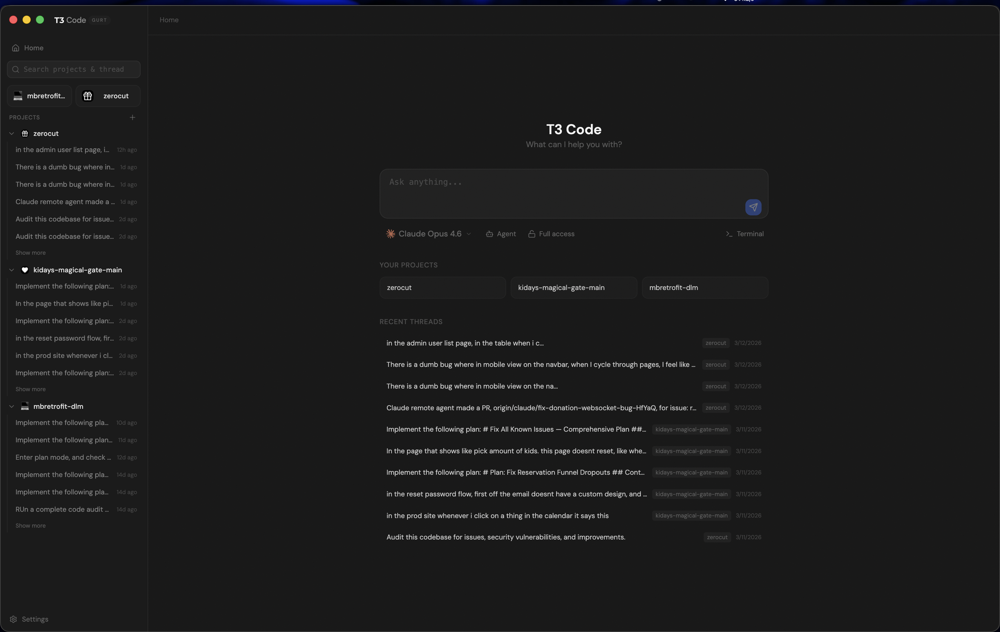
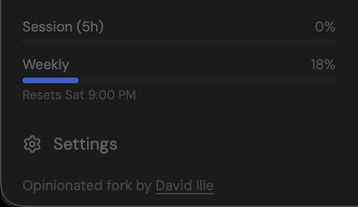
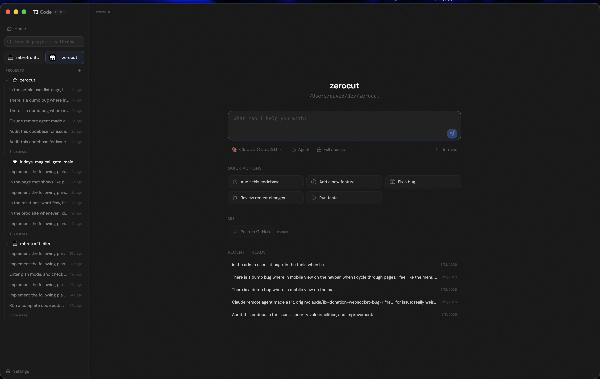
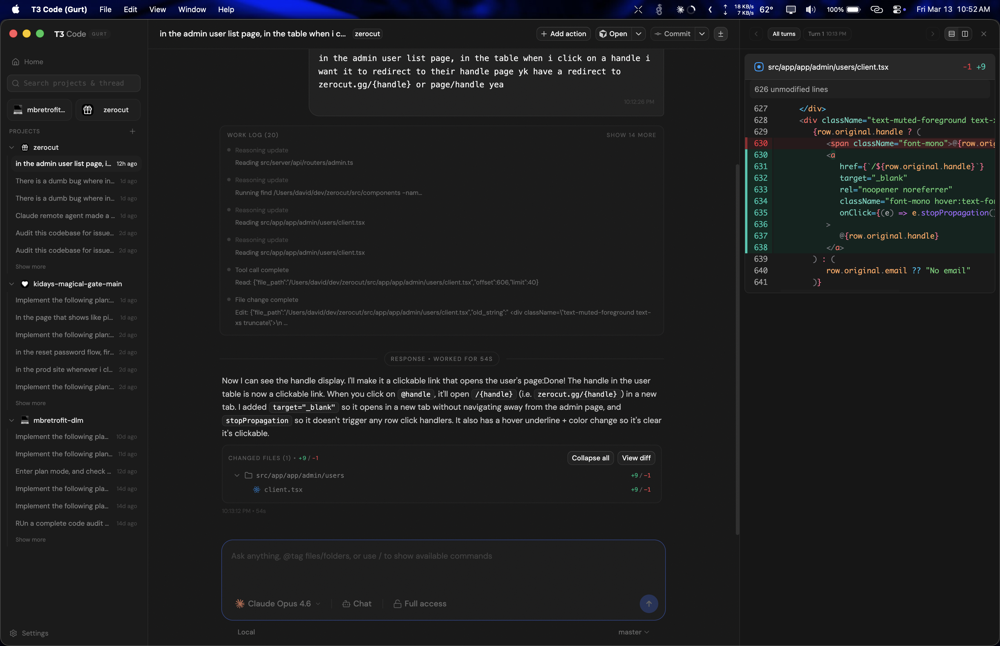
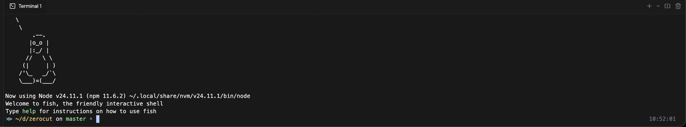

# T3 Gurt

> **Why "Gurt"?** T3 Code → T3 Co:de → T3 Yo:gurt → T3 Gurt. It's the [yo:gurt meme](https://knowyourmeme.com/memes/yogurt-gurt-yo). That's it. That's the reason.

An opinionated fork of [T3 Code](https://github.com/pingdotgg/t3code) by [Ping](https://ping.gg), built by [David Ilie](https://davidilie.com). No hate, no bans pls — just for my personal use.

Every single change in this fork was made entirely with [Claude Code](https://docs.anthropic.com/en/docs/claude-code) — zero manual edits, zero issues. From the Claude Code adapter to the marketing site, it's all agent-written.

## What's different from T3 Code

| Feature | T3 Code | T3 Gurt |
|---------|---------|---------|
| Claude Code support | Partial | Full (images, thinking, Agent SDK) |
| Claude usage tracking | No | Session + weekly + daily tiers |
| Image attachments for Claude | Text description only | Actual base64 image blocks |
| Git clone from home page | No | Paste URL and go |
| Git history browser | No | Browse commits, view diffs, search |
| SVG upload protection | No | Blocked (XSS prevention) |
| Working directory setting | No | Configurable in settings |
| MCP server management | CLI only | Full UI (add, remove, browse) |
| Imported session viewer | No | Browse + resume Claude sessions |
| Commit message instructions | No | Custom template in settings |

### Claude usage stats

See your session and weekly Claude usage at a glance — rate limit tiers, reset times, and plan info right in the sidebar.

## Screenshots

|                                               |                                                    |
| --------------------------------------------- | -------------------------------------------------- |
|  |  |
|     |                |

## Upstream

This fork tracks [pingdotgg/t3code](https://github.com/pingdotgg/t3code). See [UPSTREAM.md](./UPSTREAM.md) for sync status.

## Install

Download the [desktop app from the Releases page](https://github.com/DavidIlie/t3code/releases).

Available for macOS (Apple Silicon + Intel), Windows, and Linux.

For more info about the original project, see the [upstream repo](https://github.com/pingdotgg/t3code).
